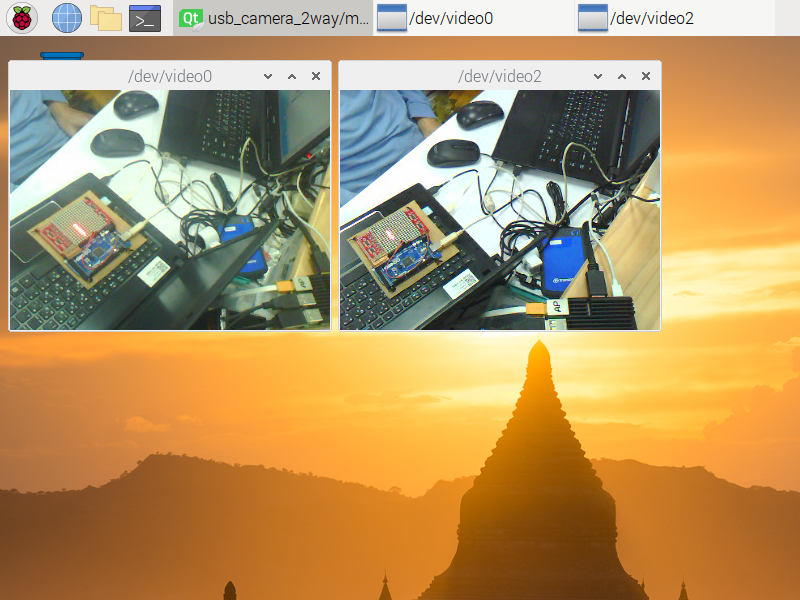

# rasp_usb_camera_qt5_gstreamer
display 1 way and 2 way USB camera  
OS is Raspbian 10, linux 5.10.103-v7+  
Qt Creator 4.8.2, Qt 5.11.3, GCC 8.3.0  
Hardware is rasp 3B  
This program supports 320x240. If I set as 640x480, the video is lag. I don't know how to set rasp to enhance proformance of overlay.  
 
  
 
  
 
# run executable file only
There is nothing to apt-get install.  
 
# compile source file
## Install Qt5
sudo apt update  
sudo apt-get update  
sudo apt-get install qt5-default  
sudo apt-get install qtcreator  
sudo apt-get install libqt5gst*  
sudo apt-get install libgstreamer*  
